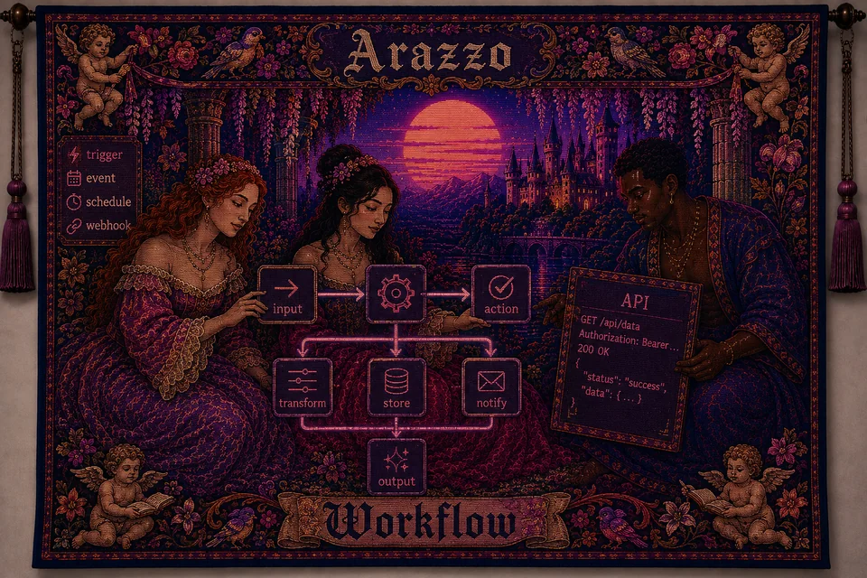
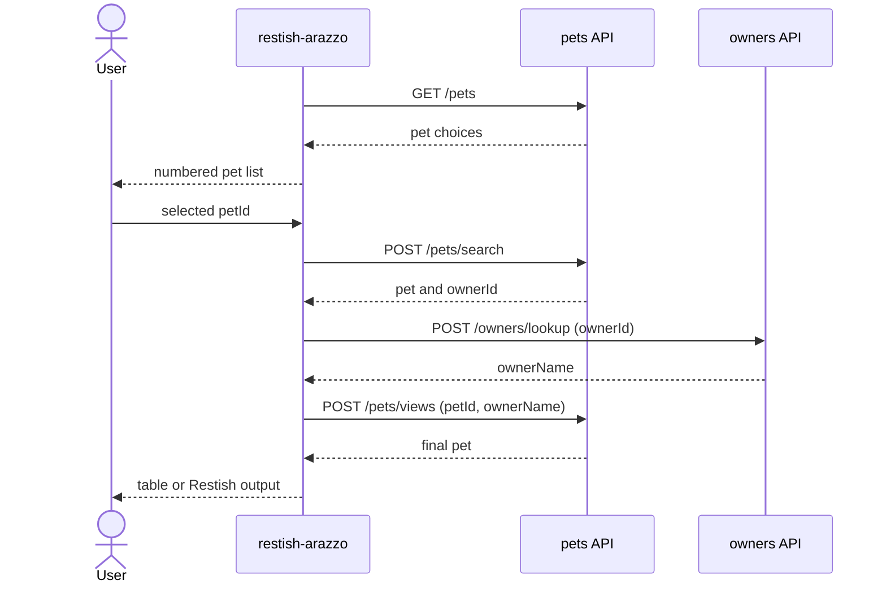

# restish-plugin-arazzo



[](https://github.com/natalie-o-perret/restish-plugins/actions/workflows/ci.yml)
[](https://pkg.go.dev/github.com/natalie-o-perret/restish-plugins/arazzo)
[](LICENSE)

`restish-plugin-arazzo` builds the `restish-arazzo` plugin, which adds
`restish workflow run FILE`. It executes [Arazzo 1.0.x][arazzo-spec] documents
containing one workflow across existing Restish API profiles. Arazzo is an
OpenAPI Initiative specification, not an RFC.

The plugin uses [`pb33f/libopenapi`](https://github.com/pb33f/libopenapi)
v0.38.7 for Arazzo parsing and execution. Restish owns HTTP, authentication,
TLS, retries, middleware, and profiles.

## Install

```console
$ go build -o restish-arazzo .
$ restish plugin install ./restish-arazzo --yes
Plugin source: ./restish-arazzo
Resolved path: ./restish-arazzo
Manifest: arazzo 0.1.0
Capabilities: command
warning: installed plugins are trusted executables and may run arbitrary code on future restish invocations
Installed plugin restish-arazzo
```

Confirm that Restish discovered the command:

```console
$ restish plugin list
arazzo               0.1.0      capabilities: command
  commands: workflow
```

## Workflow Contract

- The document contains exactly one workflow and one or more OpenAPI sources.
- Each source `name` is a registered Restish API name.
- Steps may use source-qualified `operationPath` or `operationId`. With multiple
  sources, qualify IDs as `$sourceDescriptions.SOURCE.OPERATION`.
- Required string workflow inputs are prompted interactively unless supplied by
  the API-backed selector below.
- Non-string workflow inputs are not yet supported.
- Primitive and array parameters are mapped into OpenAPI path, query, and
  header locations. Objects and non-default serialization styles are rejected.
- Parameters with duplicate names across locations or `content` serialization
  are not supported.
- Workflow parameter locations must match their OpenAPI operation definitions.
- Externally referenced OpenAPI operations and parameters are not yet supported.
- Declared workflow outputs are the command output. Without them, the last HTTP
  response body is used.

Optional workflow metadata:

```yaml
x-restish-workflow:
  select:
    input: petId
    source: pets
    method: GET
    path: /pets
    items: pets
    label: name
    value: id
  format: table
  columns: [id, name]
```

`select` makes one preflight request through the named Restish API, prints a
numbered list, and assigns the chosen `value` to `input`. The normal prompt for
that input is skipped. `method` defaults to `GET`; `path` must start with `/`.
The response can be an array of objects, or `items` can name one top-level
array field. `label` and `value` name top-level string fields in each object.
One selector is supported per workflow.

`format: table` currently supports a single object. An explicit
`RSH_OUTPUT_FORMAT` bypasses it and delegates the complete body to Restish.
This table extension is the plugin's only custom output renderer.

## Use

Given Restish APIs named `pets` and `owners`, the selector first lists pets.
The workflow then calls two `pets` endpoints and one `owners` endpoint. Save it
as `arazzo.yaml`:

```yaml
arazzo: 1.0.1
info:
  title: Find a pet and its owner
  version: 1.0.0
sourceDescriptions:
  - name: pets
    url: https://pets.example.com/openapi.yaml
    type: openapi
  - name: owners
    url: https://owners.example.com/openapi.yaml
    type: openapi
workflows:
  - workflowId: findPetOwner
    inputs:
      type: object
      required: [petId]
      properties:
        petId:
          type: string
    steps:
      - stepId: findPet
        operationPath: "{$sourceDescriptions.pets.url}#/paths/~1pets~1search/post"
        requestBody:
          contentType: application/json
          payload:
            petId: $inputs.petId
        successCriteria:
          - condition: $statusCode == 200
        outputs:
          ownerId: $response.body#/ownerId
      - stepId: findOwner
        operationPath: "{$sourceDescriptions.owners.url}#/paths/~1owners~1lookup/post"
        requestBody:
          contentType: application/json
          payload:
            ownerId: $steps.findPet.outputs.ownerId
        successCriteria:
          - condition: $statusCode == 200
        outputs:
          ownerName: $response.body#/name
      - stepId: recordView
        operationPath: "{$sourceDescriptions.pets.url}#/paths/~1pets~1views/post"
        requestBody:
          contentType: application/json
          payload:
            petId: $inputs.petId
            owner: $steps.findOwner.outputs.ownerName
        successCriteria:
          - condition: $statusCode == 200
    x-restish-workflow:
      select:
        input: petId
        source: pets
        method: GET
        path: /pets
        items: pets
        label: name
        value: id
      format: table
      columns: [id, name]
```



Run the document and choose a pet. The final `POST /pets/views` response
becomes the command output:

```console
$ restish workflow run ./arazzo.yaml
1) Mochi
2) Pixel
Select petId [1-2]: 1
┌────┬───────┐
│ ID │ NAME  │
├────┼───────┤
│ 42 │ Mochi │
└────┴───────┘
```

Captured JSON override:

```console
$ RSH_OUTPUT_FORMAT=json RSH_PRINT=bp restish workflow run ./arazzo.yaml
1) Mochi
2) Pixel
Select petId [1-2]: 1
{
  "hidden": true,
  "id": 42,
  "name": "Mochi"
}
```

## Compatibility

- Go 1.25.7 or newer is required to build the plugin.
- The manifest targets Restish plugin API v2 and the module uses Restish v2.3.0.
- Arazzo 1.0.x is supported. The current `libopenapi` version rejects 1.1.x.
- Restish plugins are trusted local executables and are not sandboxed.

## Troubleshooting

- If `restish workflow` is missing, reinstall the binary and check
  `restish plugin list`.
- If a Restish API is reported as unavailable, run `restish api list` and make
  each Arazzo source name match a configured API name.
- If manifest or command discovery fails, use the debug commands below.
- Set `RSH_OUTPUT_FORMAT=json` to bypass workflow table presentation and let
  Restish render the complete response body.

## Development

Follow the official [Plugin Quickstart](https://rest.sh/docs/plugins/quickstart/).
Build the plugin, then inspect its CBOR discovery messages as decoded JSON:

```console
$ go build -o restish-arazzo .
$ restish plugin debug ./restish-arazzo -- --rsh-plugin-manifest
$ restish plugin debug ./restish-arazzo -- --rsh-plugin-commands
```

The first command must report the `command` capability and plugin API v2. The
second must report the `workflow` command. Keep stdout reserved for Restish
protocol messages and send API requests through `plugin.CommandClient`.

[arazzo-spec]: https://spec.openapis.org/arazzo/v1.0.1.html
